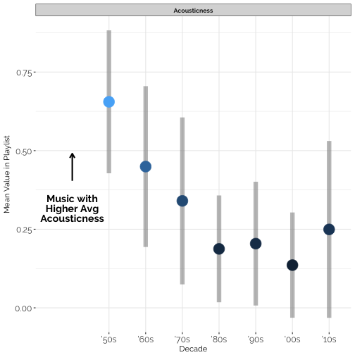
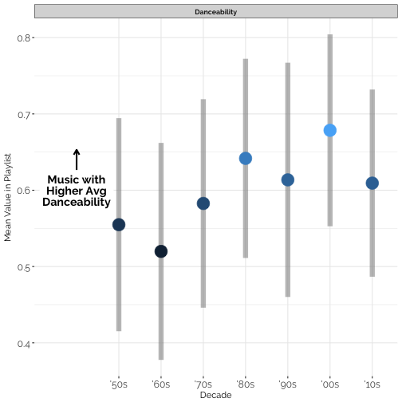
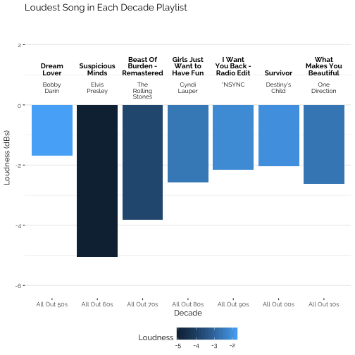
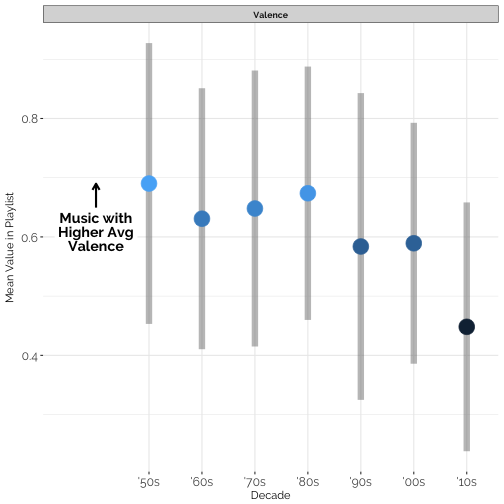
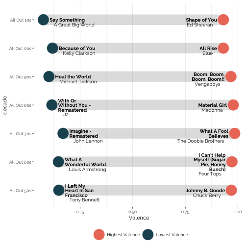
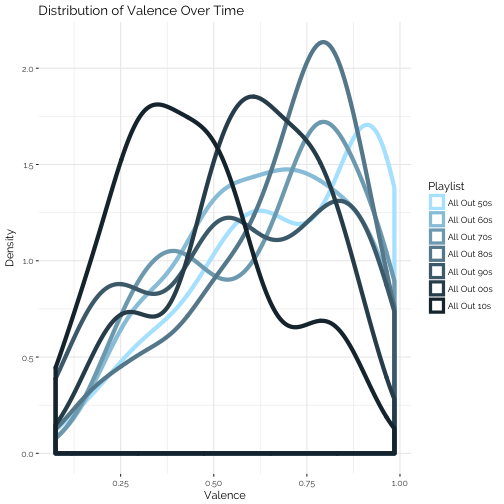

Spotify has a really accessible API!! In this script I use [spotifyr](https://www.rcharlie.com/spotifyr/), which integrates with the Spotify Web API using R, to analyze how songs in Spotify's Decades Playlists differ from each other.

In this analysis, I'll be using metrics on the songs in each decades playlist as proxies for understanding what characterized popular music in that decade. You can find all code for the analysis [here](decades.Rmd).

**Table of Contents**:  
[Reading in data](#reading-in-data)  
[Plotting the data](#plotting-the-data)  
- [Metrics of Interest](#metrics-of-interest)  
- [Acousticness](#acousticness)  
- [Danceability](#danceability)  
- [Loudness](#loudness-microphone)  
- [Valence](#valence-blush)  


## Accessing the data

We can search Spotify for the playlists we're looking for, and filter to the playlist owner. In this case, we're looking for Spotify's Decades playlists, which all begin with `All Out`, and are owned by `Spotify`.

```r
# Spotify has decades playlists, grab them here
playlists <- search_spotify("All Out", type = c("playlist")) %>%
  filter(owner.display_name == "Spotify", str_detect(name, "All Out"))
```

Now we'll read in data about each song in each playlist

```r
# Now read in information about the songs in each playlist
playlist_data <- lapply(seq_along(playlists$id), function(i) {
  get_playlist_tracks(playlists$id[i]) %>%
    pull(track.id) %>%
    get_track_audio_features() %>%
    mutate(name = playlists$name[i])
})
names(playlist_data) <- playlists$name
```


## Plotting the data

Let's look at all of the metrics, and how they're different across time. 

### Metrics of Interest
These are the metrics we're analyzing, as defined by [Spotify](https://developer.spotify.com/documentation/web-api/reference/tracks/get-audio-features/) (summaries of definitions below)
- **danceability:** how suitable a track is for dancing based on a combination of musical elements including tempo, rhythm stability, beat strength, and overall regularity  
- **energy:** a perceptual measure of intensity and activity  
- **key:** estimated overall key of the track  
- **loudness:** overall loudness of a track in decibels  
- **mode:** modality (major or minor) of a track  
- **speechiness:** the presence of spoken words in a track  
- **acousticness:** a confidence measure of whether the music is acoustic  
- **instrumentalness:** predicts whether a track contains no vocals  
- **liveness:** detects the presence of an audience in the recording  
- **valence:** the musical positiveness conveyed by a track  
- **tempo:** overall estimated tempo of a track in beats per minute  

It looks like there is a particularly interesting relationship between time and acousitcness, danceability, loudness, and valence!


```r
plot_metrics(playlist_data, metrics)
```


Let's look at these more closely.

### Acousticness



Music has gotten *less* acoustic since the '50s, but with an increased bump in acousticness in the '10s (and a big increase in variance) it might be making a comeback.

Here are the five most "acoustic" songs from '50s:

|Name                             |Artist       | Acousticness|
|:--------------------------------|:------------|------------:|
|Only You (And You Alone)         |The Platters |        0.956|
|I Left My Heart In San Francisco |Tony Bennett |        0.949|
|Peggy Sue - Single Version       |Buddy Holly  |        0.947|
|You Send Me                      |Sam Cooke    |        0.945|
|The Great Pretender              |The Platters |        0.943|

...and the top five "acoustic" songs in the '10s that may be driving a comeback:


|Name                         |Artist      | Acousticness|
|:----------------------------|:-----------|------------:|
|Lost Boy                     |Ruth B.     |        0.965|
|When I Was Your Man          |Bruno Mars  |        0.932|
|All of Me                    |John Legend |        0.920|
|Lay Me Down - Single Version |Sam Smith   |        0.916|
|All I Ask                    |Adele       |        0.889|

### Danceability

```r
plot_metric(playlist_data, "danceability")
```



Though not totally linearly, music has generally become more "dancey" since the 50s, reaching a max in the 2000s. 

These are the top classics that made the 2000s so dancey :notes:

|Name               |Artist             | Danceability|
|:------------------|:------------------|------------:|
|Temperature        |Sean Paul          |        0.951|
|One, Two Step      |Ciara              |        0.944|
|Smack That         |Akon               |        0.937|
|Hollaback Girl     |Gwen Stefani       |        0.926|
|Low (feat. T-Pain) |Flo Rida           |        0.918|
|Fergalicious       |Fergie             |        0.907|
|Yeah!              |Usher              |        0.895|
|Don't Cha          |The Pussycat Dolls |        0.875|
|I Wanna Love You   |Akon               |        0.866|
|Poker Face         |Lady Gaga          |        0.851|

### Loudness :microphone:
Music's gotten louder! With a bump in the '10s. Here is the loudest song in each decades playlist:


### Valence :blush:

```r
plot_metric(playlist_data, "valence")
```



Music has been getting sadder! Here are the songs with the highest (happiest) and lowest (saddest) valence in each of the decades playlists:



...and how they're distributed over time:


