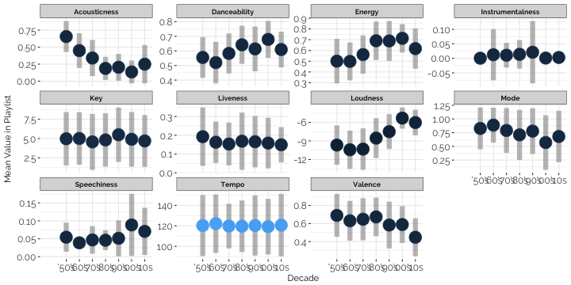

Spotify has a really accessible API!! In this script I use [spotifyr](https://www.rcharlie.com/spotifyr/), which integrates with the Spotify Web API using R, to analyze how songs in Spotify's Decades Playlists differ from each other.


## Accessing the data

We can search Spotify for the playlists we're looking for, and filter to the playlist owner. In this case, we're looking for Spotify's Decades playlists, which all begin with `All Out`, and are owned by `Spotify`.

```r
# Spotify has decades playlists, grab them here
playlists <- search_spotify("All Out", type = c("playlist")) %>%
  filter(owner.display_name == "Spotify", str_detect(name, "All Out"))
```

Now we'll read in data about each song in each playlist

```r
# Now read in information about the songs in each playlist
playlist_data <- lapply(seq_along(playlists$id), function(i) {
  message("Reading in songs from ", playlists$name[i])
  get_playlist_tracks(playlists$id[i]) %>%
    pull(track.id) %>%
    get_track_audio_features() %>%
    mutate(name = playlists$name[i])
})
```

```
## Reading in songs from All Out 00s
```

```
## Reading in songs from All Out 10s
```

```
## Reading in songs from All Out 80s
```

```
## Reading in songs from All Out 90s
```

```
## Reading in songs from All Out 70s
```

```
## Reading in songs from All Out 60s
```

```
## Reading in songs from All Out 50s
```


## Plotting the data

Let's look at all of the metrics, and how they're different across time. 

### Metrics of Interest
These are the metrics we're analyzing, as defined by [Spotify](https://developer.spotify.com/documentation/web-api/reference/tracks/get-audio-features/) (summaries of definitions below)
- *danceability:* how suitable a track is for dancing based on a combination of musical elements including tempo, rhythm stability, beat strength, and overall regularity
- *energy:* a perceptual measure of intensity and activity
- *key:* estimated overall key of the track
- *loudness:* overall loudness of a track in decibels
- *mode:* modality (major or minor) of a track
- *speechiness:* the presence of spoken words in a track
- *acousticness:* a confidence measure of whether the music is acoustic
- *instrumentalness:* predicts whether a track contains no vocals
- *liveness:* detects the presence of an audience in the recording
- *valence:* the musical positiveness conveyed by a track
- *tempo:* overall estimated tempo of a track in beats per minute




[[1]]

[[2]]

[[3]]

[[4]]

